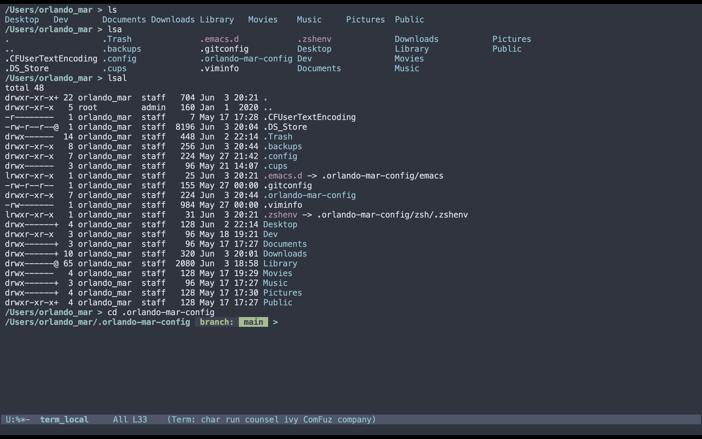
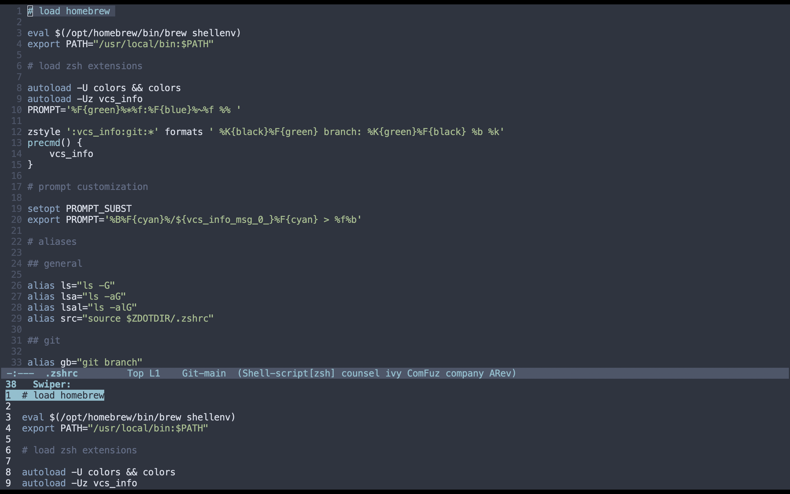

# Setup

This repo contains my emacs and zsh configuration files.

1. `git clone https://github.com/orlando-mar/.orlando-mar-config.git` into your `$HOME` dir
1. create symlinks for the `.zshenv` and `emacs` dirs in your `$HOME` dir.
      - `ln -s ~/.orlando-mar-config/emacs .emacs.d`
      - `ln -s ~/.orlando-mar-config/zsh/.zshenv .zshenv`

The first time you open emacs after adding my configuration you may receive some errors/warnings. These are mostly due to packages expecting additional dependencies that I did not include (e.g. `neotree` expects `projectile`). If you close and reopen emacs you should find that these warnings are gone

# Emacs

## Packages 

(listed in order of appearance in `init.el`)

- [use-package](https://melpa.org/#/use-package): makes installing packages & configuring easier
- [magit](https://melpa.org/#/magit): powerful git interface within emacs
- [company](https://melpa.org/#/company): incremental autocompletion
- [company-fuzzy](https://melpa.org/#/company-fuzzy): fuzzy matching for company 
- [counsel](https://melpa.org/#/counsel): enhanced ivy commands
- [ivy](https://melpa.org/#/ivy): more incremental autocomplete
- [swiper](https://github.com/abo-abo/swiper): better isearch
- [neo-tree](https://melpa.org/#/neotree): file-system navigation
- [multi-term](https://melpa.org/#/multi-term): better term-mode
- [org-journal](https://melpa.org/#/org-journal): org-based journaling
- [nord-theme](https://melpa.org/#/nord-theme): nice emacs theme using cool-colors

## Custom keybindings

(listed in order of appearance in `init.el`)

- `C-c k`: kill current buffer. 
- `C-c C-r`: rename current buffer
- `C-s`: swiper isearch
- `C-c C-n`: open neotree file navigation
- `C-c C-t`: open new multi-term buffer

# ZSH

My `zshrc` is pretty simple because many of the configurations that people often use in `zsh` are unnecessary thanks to `emacs`.
*Note:* I've included two lines to cover `homebrew` - on some machines you need the line starting with `eval` and on others you may need
the update to your `$PATH`. I leave both and don't mind the error when it appears - if you do, then remove the offending line from the `zshrc`
