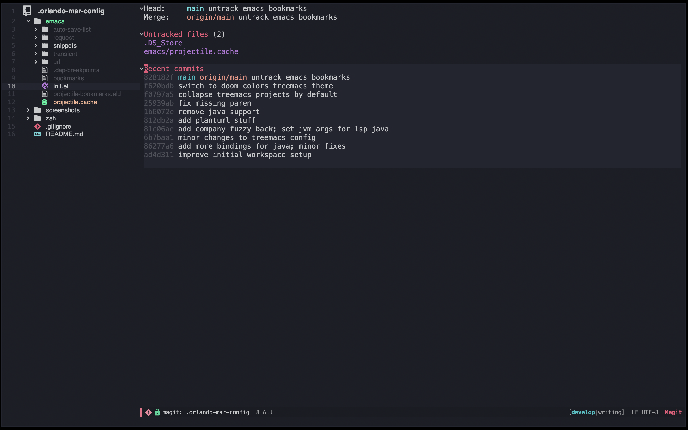

# Screenshots

Terminal emulation with `multi-term`

Robust git UI with `magit`

Project-based file discovery with `projectile`

Error checking with `flycheck`

# Setup

This repo contains my emacs and zsh configuration files.

1. `git clone https://github.com/orlando-mar/.orlando-mar-config.git` into your `$HOME` dir
1. create symlinks for the `.zshenv` and `init.el` in your `$HOME` dir
      - `ln -s ~/.orlando-mar-config/emacs/init.el ~/.emacs.d/init.el`
      - `ln -s ~/.orlando-mar-config/zsh/.zshenv .zshenv`

The `zshrc` included will `source` all files in `~/.config/zsh/` for you to add custom configs

## Required Additional First Time Setup

- For the treemacs icons to show up properly, execute `M-x all-the-icons-install-fonts`. This only needs to be done once
- For `markdown-preview` to work you need to provide a markdown processor. This `init.el` assumes that it's installed in `/usr/local/bin/multimarkdown/`, which is the usual place that `brew install multimarkdown` will install to. Adjust that as necessary for your install
- For uml rendering to work you need `plantuml` installed. You can run `plantuml-download-jar` within emacs to download it to `plantuml-jar-path`, which is set in this `init.el` to `~/.config/emacs/plantuml/plantuml.jar`
- For uml-rendering to work with non-sequence diagrams, you need to install `graphviz` and have it discoverable. If you try rendering a UML diagram in org-mode without `graphviz` installed, the output will show you where `plantuml-mode` is expecting it to be - install it to that location

